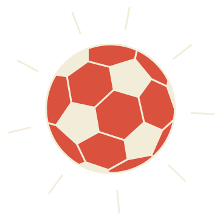

<!DOCTYPE html>
<html lang="en">

<head>
    <meta charset="UTF-8">
    <meta name="viewport" content="width=device-width, initial-scale=1.0">
    <title> 知足＋ | 一起熬夜看球賽 |</title>
    <link rel="icon" type="image/png" sizes="16x16" href="./favicon_io/favicon-16x16.png">

    <link rel="stylesheet" href="./style.css">
    <link rel="stylesheet" href="./color.css">
    <link rel="stylesheet" href="https://stackpath.bootstrapcdn.com/bootstrap/4.2.1/css/bootstrap.min.css"
        integrity="sha384-GJzZqFGwb1QTTN6wy59ffF1BuGJpLSa9DkKMp0DgiMDm4iYMj70gZWKYbI706tWS" crossorigin="anonymous">

    <link
        href="https://fonts.googleapis.com/css2?family=Montserrat:ital,wght@0,100;0,200;0,300;0,400;0,500;0,600;0,700;0,800;0,900;1,100;1,200;1,300;1,400;1,500;1,600;1,700;1,800&family=Noto+Sans+TC:wght@100;300;400;500;700;900&display=swap"
        rel="stylesheet">
    <link rel="stylesheet" href="https://cdnjs.cloudflare.com/ajax/libs/animate.css/4.1.1/animate.min.css" />
    
</head>

<body>

    <header>
        <nav class="navbar navbar-expand-lg navbar-light navbar-pc d-flex align-items-center py-0">
            <a class="navbar-brand" href="#">
                <svg id="logo" xmlns="http://www.w3.org/2000/svg" viewBox="0 0 154.49 27.24">
                    <defs>
                        
                    </defs>
                    <g id="logo_2" data-name="layer 2">
                        <g id="layer_1-2" data-name="layer 1">
                            <path class="cls-1"
                                d="M10.71,15.34a7.71,7.71,0,0,1-.26.77c.92,1.13,2,2.75,2.56,3.58a1.08,1.08,0,0,1,0,1.16l-1.79,2.92c-.28.45-.92.49-1.1.06a23.66,23.66,0,0,0-1.58-3.35A20.18,20.18,0,0,1,2.82,27a.84.84,0,0,1-1.23-.13A15.58,15.58,0,0,0,.18,25.06a.91.91,0,0,1,.26-1.31,16.71,16.71,0,0,0,5.95-8.41H2.5a.73.73,0,0,1-.74-.9l.45-2.52a.74.74,0,0,1,.7-.6H7.42l.1-.56.6-3.41H7.56A29.5,29.5,0,0,1,5.83,10a1,1,0,0,1-1.36.25c-.5-.45-1.12-1-1.66-1.36A.81.81,0,0,1,2.75,7.7a26.45,26.45,0,0,0,3.67-7A1.11,1.11,0,0,1,7.61,0L9.83.48a.75.75,0,0,1,.52,1.06c-.25.63-.51,1.26-.8,1.88h5.61a.74.74,0,0,1,.75.9l-.38,2.13a1.12,1.12,0,0,1-1.06.9h-2l-.61,3.47-.09.5h2.07a.74.74,0,0,1,.75.9l-.4,2.22a1.11,1.11,0,0,1-1.06.9Z" />
                            <path class="cls-1"
                                d="M26.94,3.22H18a1.12,1.12,0,0,0-1.06.9L14,20.65a.73.73,0,0,0,.74.9h2.34a1.13,1.13,0,0,0,1.06-.9l.2-1.13h2.86l-.12.66a.74.74,0,0,0,.74.9h2a1.12,1.12,0,0,0,1.05-.9L27.68,4.12A.74.74,0,0,0,26.94,3.22Zm-4.88,12a.47.47,0,0,1-.47.36H19.54a.31.31,0,0,1-.34-.36l1.34-7.61A.47.47,0,0,1,21,7.21h2a.31.31,0,0,1,.34.35Z" />
                            <path class="cls-1"
                                d="M42.24,21.23a24.72,24.72,0,0,0,4.21.29c1.18,0,2.52,0,4.54,0a.68.68,0,0,1,.56,1.09A20.68,20.68,0,0,0,50.36,25a1,1,0,0,1-.89.61h-4c-5.75,0-9.6-.5-12-4.76a19.74,19.74,0,0,1-4,4.77.8.8,0,0,1-1.15,0,19.69,19.69,0,0,0-1.58-1.81.68.68,0,0,1,.13-1,15.76,15.76,0,0,0,5.17-8.34.85.85,0,0,1,.86-.61l3,.36a.57.57,0,0,1,.43.83c-.13.31-.19.4-.53,1.18.52,1.88.94,2.65,2.29,3.53l1.31-7.15H32.76a.65.65,0,0,1-.66-.81l1.68-9.55a1,1,0,0,1,.95-.8H51.64a.65.65,0,0,1,.66.8L50.62,11.8a1,1,0,0,1-.95.81H43.82l-.34,1.57h6.86A.65.65,0,0,1,51,15l-.41,2.33a1,1,0,0,1-1,.81H42.79ZM37.15,8.55h9.26a.28.28,0,0,0,.27-.22l.45-2.58A.18.18,0,0,0,47,5.53H37.69a.28.28,0,0,0-.27.22L37,8.33A.18.18,0,0,0,37.15,8.55Z" />
                            <path class="cls-1"
                                d="M59.51,10.49H57.44A.4.4,0,0,1,57,10l.46-2.64a.22.22,0,0,0-.22-.27H54.63a.41.41,0,0,1-.41-.5l.36-2.08a.63.63,0,0,1,.59-.5h2.64a.34.34,0,0,0,.32-.27l.47-2.64a.62.62,0,0,1,.59-.5h2.07a.4.4,0,0,1,.41.5l-.46,2.64a.22.22,0,0,0,.22.27h2.64a.42.42,0,0,1,.42.5l-.37,2.08a.63.63,0,0,1-.59.5H60.89a.34.34,0,0,0-.32.27L60.11,10A.63.63,0,0,1,59.51,10.49Z" />
                            <path class="cls-1" d="M97.91,5.57v5.14h-.6L94.22,6.87v3.84h-.73V5.57h.6L97.18,9.4V5.57Z" />
                            <path class="cls-1"
                                d="M100.66,10.42a2.53,2.53,0,0,1-1-.94,2.76,2.76,0,0,1,0-2.69,2.6,2.6,0,0,1,1-.94,2.88,2.88,0,0,1,1.41-.34,2.81,2.81,0,0,1,1.39.34,2.53,2.53,0,0,1,1,.94,2.66,2.66,0,0,1,.35,1.35,2.63,2.63,0,0,1-.35,1.34,2.46,2.46,0,0,1-1,.94,2.81,2.81,0,0,1-1.39.35A2.89,2.89,0,0,1,100.66,10.42Zm2.42-.57a1.93,1.93,0,0,0,.72-.7,2.05,2.05,0,0,0,.26-1,2,2,0,0,0-.26-1,2,2,0,0,0-.72-.71,2,2,0,0,0-1-.26,2.1,2.1,0,0,0-1,.26,2,2,0,0,0-.72.71,2,2,0,0,0-.26,1,2.05,2.05,0,0,0,.26,1,1.93,1.93,0,0,0,.72.7,2,2,0,0,0,1,.26A1.93,1.93,0,0,0,103.08,9.85Z" />
                            <path class="cls-1" d="M109.21,6.2V8h2.58v.63h-2.58v2.08h-.73V5.57h3.63V6.2Z" />
                            <path class="cls-1"
                                d="M114.29,10.42a2.53,2.53,0,0,1-1-.94,2.76,2.76,0,0,1,0-2.69,2.6,2.6,0,0,1,1-.94,2.88,2.88,0,0,1,1.41-.34,2.81,2.81,0,0,1,1.39.34,2.53,2.53,0,0,1,1,.94,2.66,2.66,0,0,1,.35,1.35,2.63,2.63,0,0,1-.35,1.34,2.46,2.46,0,0,1-1,.94,2.81,2.81,0,0,1-1.39.35A2.89,2.89,0,0,1,114.29,10.42Zm2.42-.57a1.86,1.86,0,0,0,.72-.7,2.05,2.05,0,0,0,.26-1,2,2,0,0,0-.26-1,1.89,1.89,0,0,0-.72-.71,2,2,0,0,0-1-.26,2.1,2.1,0,0,0-1,.26,2,2,0,0,0-.72.71,2,2,0,0,0-.26,1,2.05,2.05,0,0,0,.26,1,1.93,1.93,0,0,0,.72.7,2,2,0,0,0,1,.26A1.93,1.93,0,0,0,116.71,9.85Z" />
                            <path class="cls-1"
                                d="M120.76,10.42a2.4,2.4,0,0,1-1-.94,2.69,2.69,0,0,1,0-2.69,2.47,2.47,0,0,1,1-.94,2.82,2.82,0,0,1,1.4-.34,2.87,2.87,0,0,1,1.4.34,2.51,2.51,0,0,1,1,.94,2.57,2.57,0,0,1,.35,1.35,2.53,2.53,0,0,1-.35,1.34,2.44,2.44,0,0,1-1,.94,2.88,2.88,0,0,1-1.4.35A2.82,2.82,0,0,1,120.76,10.42Zm2.42-.57a1.84,1.84,0,0,0,.71-.7,2.05,2.05,0,0,0,.26-1,2,2,0,0,0-.26-1,1.86,1.86,0,0,0-.71-.71,2.13,2.13,0,0,0-2,0,1.82,1.82,0,0,0-.72.71,1.9,1.9,0,0,0-.26,1,2,2,0,0,0,.26,1,1.8,1.8,0,0,0,.72.7,2.13,2.13,0,0,0,2,0Z" />
                            <path class="cls-1" d="M127.25,6.2h-1.76V5.57h4.25V6.2H128v4.51h-.73Z" />
                            <path class="cls-1"
                                d="M135,8.49a1.32,1.32,0,0,1,.25.83,1.18,1.18,0,0,1-.5,1,2.48,2.48,0,0,1-1.46.36h-2.46V5.57h2.31a2.23,2.23,0,0,1,1.36.35,1.13,1.13,0,0,1,.48,1,1.3,1.3,0,0,1-.18.7,1.23,1.23,0,0,1-.51.45A1.29,1.29,0,0,1,135,8.49Zm-3.43-2.33V7.81h1.5a1.51,1.51,0,0,0,.87-.21.7.7,0,0,0,.31-.62.68.68,0,0,0-.31-.61,1.51,1.51,0,0,0-.87-.21Zm2.63,3.75a.73.73,0,0,0,.31-.65c0-.57-.42-.86-1.25-.86h-1.69v1.71h1.69A1.83,1.83,0,0,0,134.2,9.91Z" />
                            <path class="cls-1"
                                d="M140,9.42h-2.73l-.57,1.29h-.75l2.33-5.14H139l2.34,5.14h-.77Zm-.25-.59L138.6,6.31l-1.11,2.52Z" />
                            <path class="cls-1" d="M142.36,5.57h.73v4.5h2.78v.64h-3.51Z" />
                            <path class="cls-1" d="M147,5.57h.74v4.5h2.78v.64H147Z" />
                            <path class="cls-1"
                                d="M154.35,9.89a.48.48,0,0,1,.14.35.78.78,0,0,1,0,.22,2.07,2.07,0,0,1-.1.31l-.34,1h-.46l.27-1.09a.5.5,0,0,1-.23-.17.55.55,0,0,1-.08-.29.52.52,0,0,1,.14-.36.48.48,0,0,1,.35-.14A.43.43,0,0,1,154.35,9.89Z" />
                            <path class="cls-1" d="M97.91,16v5.14h-.6l-3.09-3.84v3.84h-.73V16h.6l3.09,3.83V16Z" />
                            <path class="cls-1"
                                d="M100.66,20.82a2.53,2.53,0,0,1-1-.94,2.76,2.76,0,0,1,0-2.69,2.6,2.6,0,0,1,1-.94,2.88,2.88,0,0,1,1.41-.34,2.81,2.81,0,0,1,1.39.34,2.53,2.53,0,0,1,1,.94,2.66,2.66,0,0,1,.35,1.35,2.6,2.6,0,0,1-.35,1.34,2.46,2.46,0,0,1-1,.94,2.81,2.81,0,0,1-1.39.35A2.89,2.89,0,0,1,100.66,20.82Zm2.42-.57a1.93,1.93,0,0,0,.72-.7,2,2,0,0,0,.26-1,2,2,0,0,0-.26-1,2,2,0,0,0-.72-.71,2,2,0,0,0-1-.26,2.1,2.1,0,0,0-1,.26,2,2,0,0,0-.72.71,2,2,0,0,0-.26,1,2,2,0,0,0,.26,1,1.93,1.93,0,0,0,.72.7,2,2,0,0,0,1,.26A1.93,1.93,0,0,0,103.08,20.25Z" />
                            <path class="cls-1" d="M108.48,16h.73v4.5H112v.64h-3.52Z" />
                            <path class="cls-1" d="M113.13,16h.74v5.14h-.74Z" />
                            <path class="cls-1" d="M116.44,16.6v1.8H119V19h-2.58v2.08h-.74V16h3.63v.63Z" />
                            <path class="cls-1"
                                d="M124.39,20.47v.64h-3.73V16h3.63v.63H121.4v1.58H124v.63H121.4v1.66Z" />
                            <path class="cls-1"
                                d="M125.66,21a.53.53,0,0,1-.14-.37.48.48,0,0,1,.14-.35.49.49,0,0,1,.36-.15.48.48,0,0,1,.34.14.52.52,0,0,1,.14.36.53.53,0,0,1-.14.37.49.49,0,0,1-.34.14A.52.52,0,0,1,125.66,21Z" />
                            <rect class="cls-1" x="78.59" y="1.45" width="0.39" height="23.11" />
                        </g>
                    </g>
                </svg></a>

            

                <ul class="navbar-nav ">

                    <li class="nav-item">
                        <a class="nav-link" href="#quote">球星語錄</a>
                    </li>
                    <li class="nav-item">
                        <a class="nav-link" href="#info">足球必備</a>
                    </li>
                    <li class="nav-item">
                        <a class="nav-link" href="#rules">球賽規則</a>
                    </li>
                    <li class="nav-item">
                        <a class="nav-link" href="#games">必看賽事</a>
                    </li>
                </ul>
            

            

                

                    

                        
                        
                        
                    

                

            

            

                <ul class="navbar-nav-m d-flex flex-column ">

                    <li class="nav-item-m">
                        <a class="nav-link-m" href="#quote">球星語錄</a>
                    </li>
                    <li class="nav-item-m">
                        <a class="nav-link-m" href="#info">足球必備</a>
                    </li>
                    <li class="nav-item-m">
                        <a class="nav-link-m" href="#rules">球賽規則</a>
                    </li>
                    <li class="nav-item-m">
                        <a class="nav-link-m" href="#games">必看賽事</a>
                    </li>
                </ul>
            

        </nav>
    </header>
    

        

            
0

            
90

            

        

    

    <section class="">
        

            

            

                
NO

                 
                
FOOTBALL,
 
                
NO
 
                
LIFE.

                
沒有比看足球賽更重要的事

            

            

                
            

            

                <svg id="kv-pitch" xmlns="http://www.w3.org/2000/svg" viewBox="0 0 1455.35 439.46">
                    <defs>
                        
                    </defs>
                    <g id="圖層_2" data-name="圖層 2">
                        <g id="圖層_1-2" data-name="圖層 1">
                            <polygon class="cls-1"
                                points="1455.1 0 1345.09 29.48 1161.89 78.56 0.25 389.82 0.25 439.46 1455.1 439.46 1455.1 0" />
                            <g class="cls-2">
                                <line class="cls-3" x1="0.25" y1="406.52" x2="1455.1" y2="16.73" />
                                <polyline class="cls-3"
                                    points="1023.14 132.46 1023.14 44.52 1160.87 7.62 1160.87 95.62" />
                                <path class="cls-3"
                                    d="M1160.87,7.62,1180,17.17a8.06,8.06,0,0,1,4.46,7.22v46a8.08,8.08,0,0,1-2.51,5.85l-21.06,19.35" />
                                <path class="cls-3"
                                    d="M1023.14,44.52l21.75,8.88a8.07,8.07,0,0,1,5,7.47v45.38a8.06,8.06,0,0,1-2.78,6.1l-24,20.11" />
                                <path class="cls-4"
                                    d="M1160.87,95.62l21.06-20a8.08,8.08,0,0,0,2.51-5.85v-46a8.06,8.06,0,0,0-4.46-7.21L1160.87,7Z" />
                                <path class="cls-4"
                                    d="M1023.14,132.32l24-20.26a8,8,0,0,0,2.78-6.09V60.58a8.06,8.06,0,0,0-5-7.46l-21.75-8.88Z" />
                                <line class="cls-3" x1="1049.2" y1="57.59" x2="1183.6" y2="20.84" />
                                <line class="cls-3" x1="1049.9" y1="108.71" x2="1184.18" y2="72.45" />
                                <path class="cls-4"
                                    d="M1048.81,109.57l134.62-36.35a8.12,8.12,0,0,0,.59-3v-46a8.08,8.08,0,0,0-4.46-7.22L1160.45,7.4,1023.14,44.81l21.32,8.7a8.06,8.06,0,0,1,5,7.47v45.38A8.13,8.13,0,0,1,1048.81,109.57Z" />
                                <path class="cls-3"
                                    d="M1427.24,24.19,1286.42,159a2.56,2.56,0,0,1-1.13.64L575.75,349.33a2.62,2.62,0,0,1-2.49-4.42L706.58,217.27" />
                                <path class="cls-3"
                                    d="M1251,71.42l-63.9,61.23a1.2,1.2,0,0,1-.53.29l-331,88.5a1.23,1.23,0,0,1-1.16-2.07l60.41-57.87" />
                            </g>
                        </g>
                    </g>
                </svg>
            

            

                
            

            

                
            

            

        

    </section>

    <!-- -------------------------quote----------------------------------------- -->
    <section>

        

            <!-- 

                

                    <svg xmlns="http://www.w3.org/2000/svg" viewBox="0 0 30.86 27.89">
                        <defs>
                            
                        </defs>
                        <g id="圖層_2" data-name="圖層 2">
                            <g id="圖層_1-2" data-name="圖層 1">
                                <path class="cls-1"
                                    d="M23.45,27.11l-7.56-12.6a1.09,1.09,0,0,1,0-1.13L23.45.78a1.1,1.1,0,0,1,.94-.53h5.12a1.09,1.09,0,0,1,.94,1.66L23.57,13.38a1.09,1.09,0,0,0,0,1.13L30.45,26a1.09,1.09,0,0,1-.94,1.66H24.39A1.1,1.1,0,0,1,23.45,27.11Z" />
                                <path class="cls-1"
                                    d="M8,27.11.41,14.51a1.09,1.09,0,0,1,0-1.13L8,.78A1.07,1.07,0,0,1,8.9.25H14A1.1,1.1,0,0,1,15,1.91L8.08,13.38a1.14,1.14,0,0,0,0,1.13L15,26A1.1,1.1,0,0,1,14,27.64H8.9A1.07,1.07,0,0,1,8,27.11Z" />
                            </g>
                        </g>
                    </svg>
                

                

                    <svg xmlns="http://www.w3.org/2000/svg" viewBox="0 0 30.86 27.89">
                        <defs>
                            
                        </defs>
                        <g id="圖層_2" data-name="圖層 2">
                            <g id="圖層_1-2" data-name="圖層 1">
                                <path class="cls-1"
                                    d="M7.41.78,15,13.38a1.09,1.09,0,0,1,0,1.13L7.41,27.11a1.09,1.09,0,0,1-.94.53H1.35A1.1,1.1,0,0,1,.41,26L7.29,14.51a1.09,1.09,0,0,0,0-1.13L.41,1.91A1.1,1.1,0,0,1,1.35.25H6.47A1.09,1.09,0,0,1,7.41.78Z" />
                                <path class="cls-1"
                                    d="M22.9.78l7.55,12.6a1.09,1.09,0,0,1,0,1.13L22.9,27.11a1.1,1.1,0,0,1-.94.53H16.83A1.1,1.1,0,0,1,15.89,26l6.89-11.47a1.14,1.14,0,0,0,0-1.13L15.89,1.91A1.1,1.1,0,0,1,16.83.25H22A1.1,1.1,0,0,1,22.9.78Z" />
                            </g>
                        </g>
                    </svg>
                

            
 -->
            

                

                    

                    
“

                    
”

                    

                        You have to fight to reach your dream.   You have to sacrifice and work hard for it.
                    

                    
 - Lionel Messi

                    
10

                    

                    <!-- 

                    
 -->

                    

                        
10

                        
7

                        
25

                        
1

                    

                

                <!-- 

                

                

 -->

            

        

    </section>
    <!-- ----------------football-rules----------------------------------------- -->
    <main>
        

            

                

                

                

            

            

                

                    

                        

                            
90

                            
MINUTE

                            

                                
一場90分鐘的足球比賽，是數十倍計，還沒計若兩隊打成平手可能需要加時30分鐘比賽，或要射12碼分勝負的時間。「射12碼是一場足球賽中最緊張的時刻，球員已經辛苦踢了超過90分鐘。
                                

                            

                        

                    

                    

                        

                            
11

                            
PLAYERS

                            

                                
標準的足球比賽由兩隊各派十一名隊員參與，包括十名球員及一名守門員，互相在長方形的草地球場上互相對抗、互相進攻。當今世界上開展最廣、影響最大的體育項目。

                            

                        

                    

                    

                        

                            
3.5

                            
BILLION

                            

                                
今年最今統計全球共有35億足球球迷。我們都知道，只要有意義，那麼就必須慎重考慮。那麼就必須慎重考慮。足球改變了我的命運。已經成為了我生活的一部分。

                            

                        

                    

                

            

            

                

                    

                        

                            

                                

                                    <h2>Goalkeeper</h2>
                                    <h5>守門員</h5>
                                

                                

                                    <h2>Defenders</h2>
                                    <h5>後衛</h5>
                                

                                

                                    <h2>Midfielders</h2>
                                    <h5>中鋒</h5>
                                

                                

                                    <h2>Forwards</h2>
                                    <h5>前鋒</h5>
                                

                            

                        

                    

                    

                        

                        

                            

                            

                            

                            

                            

                                

                                    

                                

                                

                                    

                                

                            

                        

                    

                

            

        

        

            

                

                    

                        <h2 class="xl-title">學會這些看球賽更輕鬆</h2>
                        <h4 class="mm-title">轉播時有些規則看不懂嗎？  常見的規則大家一起來認識吧！</h4>
                    

                

                

                    

                        

                            

                            

                                <h3> Yellow and Red Cards</h3>
                                

                                    球場上發生嚴重犯規時，裁判若舉起紅牌，將不能繼續進行餘下的賽事。球隊也不能用後備球員補上。而黃牌，是對犯規球員的"記名警告"，但若吃到第二張黃牌時裁判會先出示第二面黃牌，再出示紅牌，接下來就是跟紅牌一樣的結果直接離場。
                                

                            

                        

                    

                

                

                    

                        

                            

                            

                                <h3> Corner kick</h3>
                                
當守方球員將皮球送出底線，攻方就會得到角球。此規則在1867年第一次在謝菲爾德規則下使用，並於1872年被國際足總所採用。
                                    角球弧位於底線與邊線的交點處，是一個半徑1米的四分之一弧。角球弧內稱為角球區，四個角球區內各豎角旗。
                                

                            

                        

                    

                

                

                    

                        

                            

                            

                                <h3> Penalty kick</h3>
                                
罰十二碼，是足球比賽中，守方球員在己方禁區內犯規而判罰的一種死球。由於罰十二碼的進球率在足球運動所有死球判罰中最高，因此被稱為足球的極刑。在未出現判罰十二碼的規則時，當球員在禁區內犯規，只會被罰自由球，而且可以排人牆。
                                

                            

                        

                    

                

                

                    

                        

                            

                            

                                <h3> Offside</h3>
                                
越位是對攻方向前傳球時，接球站到的位置作出嚴格限制。當球員所在的位置比「球和站在最後第二位的對方球員更靠近對方底線」，就處於越位位置。但若此球員處於本方半場內，則不受此限制。如果球員和第二名對方球員平行，亦不算越位。
                                

                            

                        

                    

                

            

        

        

            

                

                    

                        
                        

                        

                    

                

            

        

        

            

                

                    <h2 class="xl-title">球迷不能錯過的賽事</h2>
                    <h4 class="mm-title">想熬夜看球賽不知道要看什麼？  放心有很多球賽可以每天看不完！</h4>
                

            

            

                

                    

                        
                        <h4>世界盃足球賽</h4>
                    

                    

                        
                        <h4>歐洲五大聯賽</h4>
                    

                    

                        
                        <h4>歐洲冠軍聯賽</h4>
                    

                

                

                    

                        

                            

                                <h5>FIFA World Cup 世界盃足球賽</h5>
                            

                            

                                國際足球總會世界盃，簡稱世界盃、世足賽，是一項國家級男子足球隊之間的國際比賽，每4年舉辦一次，亦為世界足壇規模最大、最具影響力的賽事；自1998年法國世界盃起，電視轉播觀眾人數達到40億人次。
                            

                        

                    

                

            

        

        

            

                <h5>JOIN US!!!&nbsp;&nbsp;&nbsp;JOIN US!!!&nbsp;&nbsp;&nbsp;JOIN US!!!&nbsp;&nbsp;&nbsp;JOIN
                    US!!!&nbsp;&nbsp;&nbsp;JOIN US!!!&nbsp;&nbsp;&nbsp;JOIN US!!!&nbsp;&nbsp;&nbsp;JOIN
                    US!!!&nbsp;&nbsp;&nbsp;JOIN US!!!&nbsp;&nbsp;&nbsp;JOIN US!!!&nbsp;&nbsp;&nbsp;JOIN
                    US!!!&nbsp;&nbsp;&nbsp;JOIN US!!!&nbsp;&nbsp;&nbsp;JOIN US!!!&nbsp;&nbsp;&nbsp;JOIN
                    US!!!&nbsp;&nbsp;&nbsp;JOIN US!!!&nbsp;&nbsp;&nbsp;JOIN US!!!&nbsp;&nbsp;&nbsp;JOIN
                    US!!!&nbsp;&nbsp;&nbsp;JOIN US!!!&nbsp;&nbsp;&nbsp;</h5>
            

        

        

            

                <svg id="mailimg" xmlns="http://www.w3.org/2000/svg" xmlns:xlink="http://www.w3.org/1999/xlink"
                    viewBox="0 0 137.93 182.81">
                    <defs>
                        
                        <pattern id="_10_dpi_20_2" data-name="10 dpi 20% 2" width="28.8" height="28.8"
                            patternTransform="translate(96.15 96.15) scale(0.76)" patternUnits="userSpaceOnUse"
                            viewBox="0 0 28.8 28.8">
                            <rect class="cls-11" width="28.8" height="28.8" />
                            <path class="cls-22"
                                d="M28.8,30.24a1.44,1.44,0,1,0-1.44-1.44A1.44,1.44,0,0,0,28.8,30.24Z" />
                            <path class="cls-22" d="M14.4,30.24A1.44,1.44,0,1,0,13,28.8,1.44,1.44,0,0,0,14.4,30.24Z" />
                            <path class="cls-22"
                                d="M28.8,15.84a1.44,1.44,0,1,0-1.44-1.44A1.44,1.44,0,0,0,28.8,15.84Z" />
                            <path class="cls-22" d="M14.4,15.84A1.44,1.44,0,1,0,13,14.4,1.44,1.44,0,0,0,14.4,15.84Z" />
                            <path class="cls-22" d="M7.2,23A1.44,1.44,0,1,0,5.76,21.6,1.44,1.44,0,0,0,7.2,23Z" />
                            <path class="cls-22" d="M21.6,23a1.44,1.44,0,1,0-1.44-1.44A1.44,1.44,0,0,0,21.6,23Z" />
                            <path class="cls-22" d="M7.2,8.64A1.44,1.44,0,1,0,5.76,7.2,1.44,1.44,0,0,0,7.2,8.64Z" />
                            <path class="cls-22" d="M21.6,8.64A1.44,1.44,0,1,0,20.16,7.2,1.44,1.44,0,0,0,21.6,8.64Z" />
                            <path class="cls-22"
                                d="M0,30.24A1.44,1.44,0,0,0,1.44,28.8,1.45,1.45,0,0,0,0,27.36,1.44,1.44,0,0,0-1.44,28.8,1.43,1.43,0,0,0,0,30.24Z" />
                            <path class="cls-22"
                                d="M0,15.84A1.44,1.44,0,0,0,1.44,14.4,1.45,1.45,0,0,0,0,13,1.44,1.44,0,0,0-1.44,14.4,1.43,1.43,0,0,0,0,15.84Z" />
                            <path class="cls-22"
                                d="M28.8,1.44A1.45,1.45,0,0,0,30.24,0,1.44,1.44,0,0,0,28.8-1.44,1.43,1.43,0,0,0,27.36,0,1.44,1.44,0,0,0,28.8,1.44Z" />
                            <path class="cls-22"
                                d="M14.4,1.44A1.45,1.45,0,0,0,15.84,0,1.44,1.44,0,0,0,14.4-1.44,1.43,1.43,0,0,0,13,0,1.44,1.44,0,0,0,14.4,1.44Z" />
                            <path class="cls-22"
                                d="M0,1.44A1.45,1.45,0,0,0,1.44,0,1.44,1.44,0,0,0,0-1.44,1.43,1.43,0,0,0-1.44,0,1.44,1.44,0,0,0,0,1.44Z" />
                        </pattern>
                    </defs>
                    <g id="圖層_2" data-name="圖層 2">
                        <g id="mailimg33" data-name="圖層 1">
                            <path class="cls-33"
                                d="M103.25,86.55v79.1A12.19,12.19,0,0,1,91.1,177.81H31.84a12.19,12.19,0,0,1-12.16-12.16V87.94a1.27,1.27,0,0,1,2.1-1c5.93,5,26.2,16.15,46.9,6,2.44-1.38,2.65,3.26,10.25-.46,5.06-2.48,4.14-5.9,4.14-5.9,7.54-2.66,11.64-2.1,19-1.33A1.28,1.28,0,0,1,103.25,86.55Z" />
                            <path class="cls-44"
                                d="M29.25,67.91h34a1.25,1.25,0,0,1,1.26,1.26V86.49a8.87,8.87,0,0,0,8.85,8.85h0a8.87,8.87,0,0,0,8.85-8.85V80.92a1.26,1.26,0,0,1,1.3-1.25h0c4.87,0,8.85-3.23,8.85-8.09V69.17a1.26,1.26,0,0,1,1.26-1.26h6.11a19.12,19.12,0,0,0,19.06-19.07h0a19.14,19.14,0,0,0-13.49-18.23,1.25,1.25,0,0,1-.87-1.12A31.84,31.84,0,0,0,72.73,0h0A31.72,31.72,0,0,0,47.67,12.33a1.26,1.26,0,0,1-1.51.39,19.19,19.19,0,0,0-7.83-1.67H37.14A19.4,19.4,0,0,0,17.87,28.79a1.26,1.26,0,0,1-1.09,1.13A19.13,19.13,0,0,0,0,48.84H0A19.12,19.12,0,0,0,19.07,67.91H29.25Z" />
                            <path class="cls-55"
                                d="M106.36,70.76v97.83a13.26,13.26,0,0,1-13.22,13.22H28.67a13.26,13.26,0,0,1-13.23-13.22V70.39" />
                            <path class="cls-55"
                                d="M31,67.3H64.11a1.23,1.23,0,0,1,1.23,1.23V85.44A8.67,8.67,0,0,0,74,94.08h0a8.67,8.67,0,0,0,8.64-8.64V80a1.23,1.23,0,0,1,1.27-1.22h0c4.75,0,8.64-3.15,8.64-7.9V68.53a1.23,1.23,0,0,1,1.23-1.23h6a18.67,18.67,0,0,0,18.61-18.61h0a18.69,18.69,0,0,0-13.17-17.8,1.22,1.22,0,0,1-.84-1.1A31.09,31.09,0,0,0,73.42,1h0A31,31,0,0,0,49,13a1.23,1.23,0,0,1-1.47.39,18.68,18.68,0,0,0-7.65-1.64H38.67A19,19,0,0,0,19.85,29.1a1.21,1.21,0,0,1-1.06,1.11A18.67,18.67,0,0,0,2.41,48.69h0A18.67,18.67,0,0,0,21,67.3h5.49" />
                            <path class="cls-55"
                                d="M108.9,77.25h17.89a10.41,10.41,0,0,1,10.14,10.66v56.31a10.41,10.41,0,0,1-10.14,10.66H106.68" />
                            <path class="cls-55"
                                d="M109.93,87.44h13.35a3.23,3.23,0,0,1,3.23,3.22v51a3.23,3.23,0,0,1-3.23,3.22H109.93" />
                            <polyline class="cls-55" id="checked" points="40.36 133.69 55.38 154.88 89.25 111.12" />
                        </g>
                    </g>
                </svg>
            

            

                

                    <form class="my-4 col-12 col-lg-4">
                        

                            <!-- <label for="exampleInputEmail1">Email address</label> -->

                            <input type="input" class="form-control col-12 mb-3" placeholder="E-mail" id="email-input">
                            <button id="email-btn" type="button" class="btn col-12 px-3">訂閱我們！</button>
                        

                    </form>
                

                </form>
            

        

        

    </main>
    <footer class="py-5">
        

            

                

                    

                        <svg xmlns="http://www.w3.org/2000/svg" viewBox="0 0 64.02 64.02">
                            <defs>
                                
                            </defs>
                            <g id="圖層_2" data-name="圖層 2">
                                <g id="圖層_1-2" data-name="圖層 1">
                                    <rect class="cls-social" x="0.75" y="0.75" width="62.52" height="62.52" rx="12" />
                                    <path class="cls-social"
                                        d="M39.06,26.39H34.85V22.27a1.68,1.68,0,0,1,1.68-1.68h2.53a1.17,1.17,0,0,0,1.18-1.17V16.49a1.17,1.17,0,0,0-1.18-1.17H33.6a6.36,6.36,0,0,0-6.36,6.36v4.71H24.75a1.17,1.17,0,0,0-1.17,1.17v2.93a1.17,1.17,0,0,0,1.17,1.17h2.49V47.53a1.17,1.17,0,0,0,1.17,1.17h5.26a1.18,1.18,0,0,0,1.18-1.17V31.66h3.74a1.17,1.17,0,0,0,1.16-1l.47-2.93A1.17,1.17,0,0,0,39.06,26.39Z" />
                                </g>
                            </g>
                        </svg>
                    

                    

                        <svg xmlns="http://www.w3.org/2000/svg" viewBox="0 0 64.02 64.02">
                            <defs>
                                
                            </defs>
                            <g id="圖層_2" data-name="圖層 2">
                                <g id="圖層_1-2" data-name="圖層 1">
                                    <rect class="cls-social" x="0.75" y="0.75" width="62.52" height="62.52" rx="12" />
                                    <circle class="cls-social" cx="32.21" cy="34.01" r="12.59" />
                                    <circle class="cls-social" cx="50.35" cy="14.33" r="2.74" />
                                </g>
                            </g>
                        </svg>
                    

                    

                        <svg xmlns="http://www.w3.org/2000/svg" viewBox="0 0 64.02 64.02">
                            <defs>
                                
                            </defs>
                            <g id="圖層_2" data-name="圖層 2">
                                <g id="圖層_1-2" data-name="圖層 1">
                                    <rect class="cls-social" x="0.75" y="0.75" width="62.52" height="62.52" rx="12" />
                                    <path class="cls-social"
                                        d="M42.43,30.25,25.59,20.53a2,2,0,0,0-3.05,1.75V41.73a2,2,0,0,0,3.05,1.76l16.84-9.73A2,2,0,0,0,42.43,30.25Z" />
                                </g>
                            </g>
                        </svg>
                    

                

                

                    
Thank You!

                    
Thank You! Thank You!

                

            

        

    </footer>

    
    
</body>

</html>
